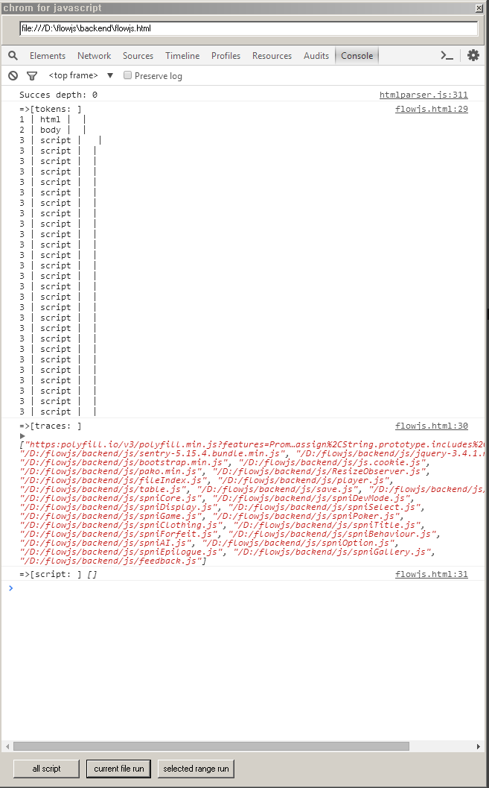

# notepad++ plugin(npp stringworker for only x86(win32))

Notepad++ Plugin  stringworker

## . install

1. mkdir C:\Program Files\Notepad++\plugins\stringworker
2. copy (all file in bin dir) to (mkdir)

or

1. using stringworker.0.1_x86.zip 

  

